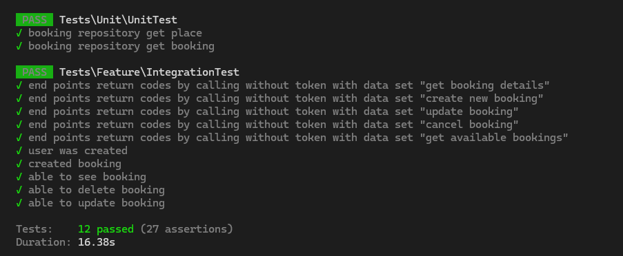

<p align="center"><a href="https://laravel.com" target="_blank"></a></p>

<p align="center">
<a href="https://github.com/laravel/framework/actions"></a>
<a href="https://packagist.org/packages/laravel/framework"></a>
<a href="https://packagist.org/packages/laravel/framework"></a>
<a href="https://packagist.org/packages/laravel/framework"></a>
</p>

## Launching

- clone repository
- `cd cavu` - go to project directory
- `./install.sh` or `./start.sh` - run docker containers for project: PHP and MySQL
- `docker ps` - find running PHP container name, f.e.: `cavu-php-1`
- `docker exec -it cavu-php-1 bash` - go inside of container
- `cp .env.example .env` - copy environment files
- `composer install`
- `php artisan migrate:fresh --seed`

## End-Points

- `http://127.0.0.1/api/register` - user registration 
```
curl --location 'http://127.0.0.1/api/register' \
--header 'Accept: application/json' \
--header 'Content-Type: application/json' \
--data-raw '{
    "name": "test",
    "email": "test@test.co.uk",
    "password": "password123",
    "password_confirmation": "password123"
}'
```
- `http://127.0.0.1/api/login` - existent user login
```
curl --location 'http://127.0.0.1/api/login' \
--header 'Accept: application/json' \
--header 'Content-Type: application/json' \
--data-raw '{
    "email": "test@test.co.uk",
    "password": "password123"
}'
```
- `http://127.0.0.1/api/logout` - logout (requires authorization token)
```
curl --location --request POST 'http://127.0.0.1/api/logout' \
--header 'Accept: application/json' \
--header 'Authorization: Bearer 1|jLutbsfdSFKMaw2jU3wrDaIOeb7lEsSNVpi5G83995123f38'
```
- `http://127.0.0.1/api/booking/available` - places availability in dates range. Doesn't require authorization token. Returns list of dates with available places and prices. **Price generated: base price + summer/winter markup + weekend markup.**
```
curl --location --request GET 'http://127.0.0.1/api/booking/available' \
--header 'Accept: application/json' \
--header 'Content-Type: application/json' \
--data '{
    "start_at": "2024-04-01",
    "end_at": "2024-06-01"
}'
```
- `http://127.0.0.1/api/booking` - POST - create booking for a days
```
curl --location --request POST 'http://127.0.0.1/api/booking' \
--header 'Accept: application/json' \
--header 'Content-Type: application/json' \
--header 'Authorization: Bearer 1|0TZC2BT4nRCWhGtJpgX9YMavtsIs04fSemNqJb9176bb68a0' \
--data '{
    "start_at": "2024-03-27",
    "end_at": "2024-03-31"
}'
```
- `http://127.0.0.1/api/booking` - PUT - update booking if exists
```
curl --location --request PUT 'http://127.0.0.1/api/booking' \
--header 'Accept: application/json' \
--header 'Content-Type: application/json' \
--header 'Authorization: Bearer 1|0TZC2BT4nRCWhGtJpgX9YMavtsIs04fSemNqJb9176bb68a0' \
--data '{
    "start_at": "2024-03-28",
    "end_at": "2024-03-31"
}'
```
- `http://127.0.0.1/api/booking/details` - GET - get booking details if exists - one customer can have only one valid (starts or ends after today) booking. 
```
curl --location 'http://127.0.0.1/api/booking/details' \
--header 'Accept: application/json' \
--header 'Authorization: Bearer 1|0TZC2BT4nRCWhGtJpgX9YMavtsIs04fSemNqJb9176bb68a0' \
--data ''
```
- `http://127.0.0.1/api/booking` - DELETE - cancel booking if exists
```
curl --location --request DELETE 'http://127.0.0.1/api/booking' \
--header 'Accept: application/json' \
--header 'Authorization: Bearer 1|0TZC2BT4nRCWhGtJpgX9YMavtsIs04fSemNqJb9176bb68a0' \
--data ''
```

## Testing

- `php artisan test` run inside of container. Issues: uses local DB instead of testing sqlite - needs fixing


